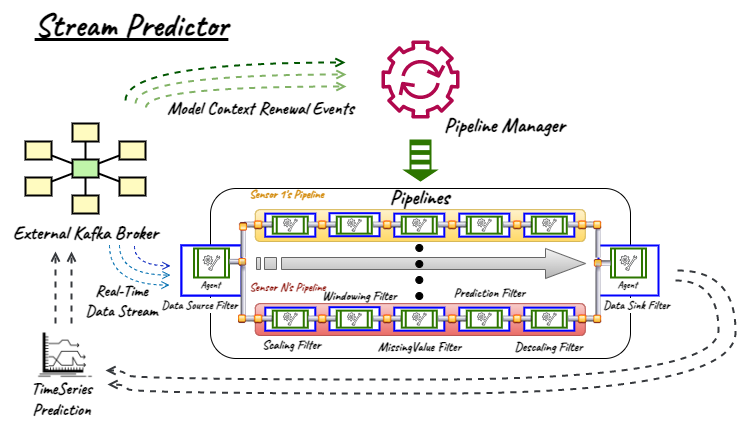

# stream-predictor
## 주요 기능
- Model Context 변경 이벤트를 수신하여 파싱하고, 그에 따른 시계열 데이터 예측 파이프라인을 형성합니다.
- 각 모델 별 실시간 스트림 데이터를 파이프라인에 흘려보내 시계열 데이터 예측 스트림을 생성합니다.

<div align="center">
  
</div>

## 실행
### 환경변수
##### required
- ```KAFKA_BOOTSTRAP_SERVER```: 카프카 브로커 주소
- ```KAFKA_CONTEXT_RENEWAL_TOPIC```: 모델 컨텍스트 갱신 이벤트 토픽 이름
- ```KAFKA_SOURCE_TOPIC```: 데이터 스트림 소스 토픽 이름
- ```KAFKA_SINK_TOPIC```: 예측 결과 전송 토픽 이름
##### optional
- ```APP_NUM_FETCH_DATA```: 파이프라인 구성 이후 수동적으로 가져올 최신 데이터 개수, <b>default</b>: 500
- ```APP_MAX_ALL_FEATURE_ARRIVAL_TIMEOUT_MILLISECONDS```: 각 설명 변수 데이터를 동일 Point에 들어온 데이터라고 가정할 수 있는 최대 타임스탬프 간격, <b>default</b>: 2000
- ```APP_CONTEXT_DIR```: CachedFileModelContextRepository에서 사용하는 Model Context파일 저장 경로, <b>default</b>: '/var/cache/context'
### Docker Container로 실행하는 경우
- 이미지 가져오기
```shell
$ docker pull youngminan/predictor
```
- (optional) nightly build
```shell
$ docker build -t {IMAGE TAG} .
```

- run<br>
```shell
$ docker run -d --net host --restart=always -e KAFKA_BOOTSTRAP_SERVER="{KAFKA_BROKER}" -e KAFKA_CONTEXT_RENEWAL_TOPIC={CONTEXT_RENEWAL_TOPIC} -e KAFKA_SOURCE_TOPIC={DATA_STREAM_SOURCE_TOPIC}  -e KAFKA_SINK_TOPIC={PREDICTION_RESULT_SINK_TOPIC}  -v {HOST_VOLUME_FOR_CACHING_CONTEXTS}:/var/cache/context --name {CONTAINER_NAME} youngminan/predictor
```


### Python3.8 인터프리터로 실행하는 경우
```shell
...  ...
$ pip install -r requirements.txt
$ python ./predictor/src/aiokafka_agent_main.py
```
## 주의사항
- 현재 Faust 기반 컴포넌트는 데드락 구현 오류로 동작하지 않습니다. (2023.04.30)
- 모든 설명 변수가 동일한 주기로 <b>*비슷한 타임스탬프</b>에 들어온다고 가정하였습니다.<br>
<i>*비슷한 타임스탬프: ```APP_MAX_ALL_FEATURE_ARRIAVAL_TIMEOUT_MILLISECONDS```이내</i>
- <b>*비슷한 타임스탬프</b>를 초과하여 들어오는 데이터는 시계열 데이터 구성에서 서로 다른 Point가 됩니다.